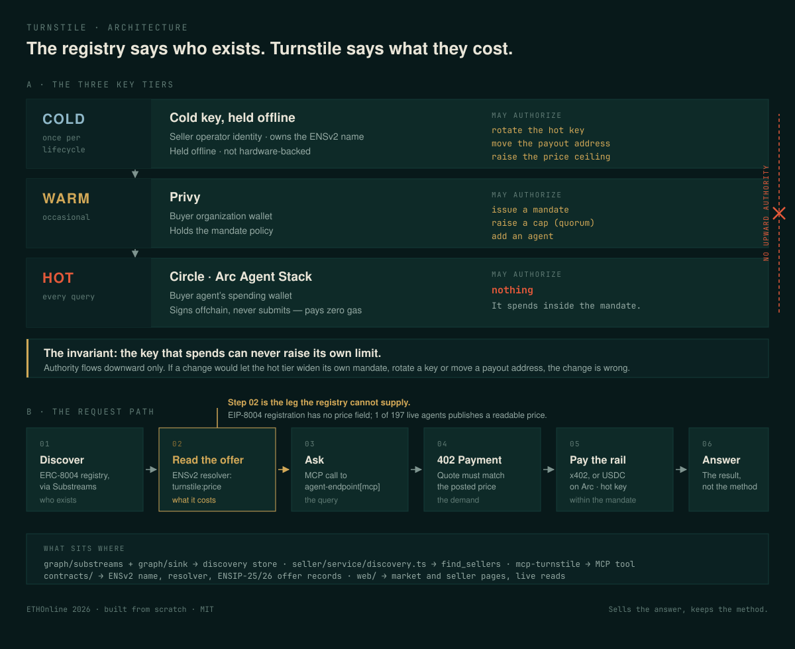

# Turnstile

**A paid lane for onchain data agents. Sell the answer, keep the method.**

ETHOnline 2026 · From Scratch · [IpastorSan/turnstile](https://github.com/IpastorSan/turnstile)

Agents that sell onchain analysis have no way to be discovered, priced or
trusted, and no way to sell an *edge* — publishing the analyst reveals the
method. Buyers have no way to let an agent spend without handing it a key.
Turnstile fixes both ends: sellers publish a priced service at an ENSv2 subname
where the resolver record *is* the offer, and buyers issue a mandate their agent
spends inside but can never widen.

```bash
npm run demo      # one query: discovered, priced from chain, paid on both rails, answered
npm run verify    # 516 tests: 426 node, 90 Forge, 13 of them forked against live Sepolia
```

**Not installing anything?** [**Read the walkthrough**](./walkthrough/index.html) —
six pages, one idea each, about fifteen minutes. It goes from the problem to a
settled payment on two chains without leaving the browser, and every page ends
with either a transaction you can open or a sentence saying we did not prove it.
Pages three and five are where this project is weakest; they are on the page
rather than hidden.


*The whole problem in one screen. 197 real registrations; one posts a price on
chain, 97 will answer if you ask and none do, 99 have no price at all. Captured
2026-09-11 from the public deployment; the directory itself is a 2026-09-07 snapshot.*

**Built with AI, and documented as such.** Claude Code agents wrote essentially
all of this code, one issue per worktree and per branch, directed by a human who
made every outward-facing decision and forced the corrections in
[`CORRECTIONS.md`](./CORRECTIONS.md). The full disclosure is
[**`AI-USE.md`**](./AI-USE.md), and the planning artifacts the agents were
pointed at are in [`planning/`](./planning/).

**Every claim in this README is linked to a transaction or marked as unproven, in
[`docs/EVIDENCE.md`](./docs/EVIDENCE.md).** That page has a "what is not live"
section, and two rows that tell you not to cite something as attested when it
is not. Start there if you are here to check rather than to read.

There is also a [48-second screen recording](./docs/walkthrough.mp4) of the
product being used, ending on a cap raise being refused. It is scripted rather
than performed, so it can be re-recorded after any change — and it is **not** a
submission video: no audio, no narration.

| | |
|---|---|
| Real money settled | HBAR on Hedera via Blocky402, USDC on Arc via Circle Gateway. Same query, both rails, same answer |
| Enforced on chain | The hot key's payout change **reverts**. Fork test against live Sepolia, not a mock |
| Zero gas, provably | The spending agent's nonce is still 0 after eleven payments |
| Measured, not asserted | 197 real ERC-8004 registrations read; exactly **one** publishes a price you can read before you call it |

## The three key tiers

Three wallet vendors is not three ways to do one thing. Each sits where it is
actually best, and together they are one cold/warm/hot hierarchy.

| Tier | Vendor | Holds | Frequency | May authorize |
|---|---|---|---|---|
| **Cold** | A separate key. Custody is **not** cold today, see [`CORRECTIONS.md`](./CORRECTIONS.md) | Seller operator identity; owns the ENSv2 name | Once per lifecycle | Hot-key rotation, payout address change, price-ceiling raise |
| **Warm** | Privy | Buyer **organization** wallet + mandate policy | Occasional | Issuing a mandate, raising a cap (quorum), adding an agent |
| **Hot** | Circle / Arc Agent Stack | Buyer agent's spending wallet | Every query | Nothing. Spends *within* the mandate; **signs offchain and never submits a transaction**, so it pays exactly zero gas |

Every claim in that table is either proven on chain or marked as not proven, in
[`docs/EVIDENCE.md`](./docs/EVIDENCE.md). Three of these rows have been corrected
during the build, including one where the Cold row claimed offline custody we do
not have; the full record with dates and reasons is in
[`CORRECTIONS.md`](./CORRECTIONS.md).

The property that matters: **the key that spends can never raise its own limit.**

## Architecture



Two panels: where the keys sit, and what happens when an agent buys an answer.
Full walkthrough, including which steps are live today and which are not, in
[`docs/architecture.md`](./docs/architecture.md).

The short version of the request path:

```
01 Discover  →  02 Read the offer  →  03 Ask  →  04 402  →  05 Pay  →  06 Answer
   ERC-8004      ENSv2 resolver       MCP        quote     x402 /      result, not
   Substreams    turnstile:price                           USDC on Arc  the method
```

**All six steps run today**, and the settlement half moves real money: HBAR
through Blocky402 on Hedera, and USDC on Arc through Circle Gateway
nanopayments, with the same query answered identically over both rails. Every
transaction is linked in [`CHECKLIST.md`](./CHECKLIST.md). ~~The one real gap is
deployment rather than capability: the address published in `agent-endpoint[mcp]`
has no DNS record yet, so step 03 works from the repo and not from the open
internet.~~

**Update (2026-09-11, MOV-273):** this previously said the published host had no
DNS record. It changed because the stack went live on 2026-09-11:
<https://turnstile.moveseventyeight.com> serves the web app, and the x402 service
on it answers `402 Payment Required` at `/analyze/:pool` (verified 2026-09-11
over real TLS). **What is still true is the gap itself — it moved from the host to
the path.** `agent-endpoint[mcp]` publishes `…/liquidity.turnstile.eth/sse`, and
that exact URL returns **404**: `mcp-turnstile` is a stdio MCP server and nothing
in this repo serves MCP over HTTP. A buyer's agent that follows the ENS record
literally still finds nothing to pay. See [`docs/deploy.md`](./docs/deploy.md).
`docs/architecture.md` gives the per-step state.

## The web app

```bash
cd web && npm install
npm run dev        # http://localhost:3210
```

| Route | What it does |
|---|---|
| `/` | Market. All 197 real ERC-8004 registrations across Base, mainnet and Sepolia, filterable by capability, chain, price ceiling and x402 support. |
| `/seller/[name]` | One seller's ENSv2 records, read from Sepolia on every request. Nothing cached, nothing hard-coded. |
| `/mandate` | **Live.** Reads the org wallet, both key quorums, the mandate policy and the allowlist from Privy on request, plus a per-rail ledger of what the agent has actually spent. `/mandate/new` issues your own — operator signing keys are generated in your browser and never sent. See [`docs/privy-mandate.md`](./docs/privy-mandate.md). **Correction (2026-09-09, MOV-266):** this row read "Labelled placeholder … it is the *page* that is not built". That was true until 2026-09-08 and is not now. |
| `/onboard` | Labelled placeholder, genuinely blocked: World Sandbox approval has not arrived, so there is no credential to verify against. Deliberately not faked. **Correction (2026-09-11, MOV-277):** this row is out of date. `/onboard` has run World Selfie Check since 2026-09-09, and the first real Sandbox App proof was verified by World on 2026-09-11 at 09:06:02 UTC. It was stored under the ENS name while the market reads by agent id, so the market still showed `unknown`. The page now picks the listing from the discovery store (the registered `liquidity.turnstile.eth`, or another `turnstile.eth` subname as a labelled reservation), the server stores the proof under the agent id, and it shows listings used of three and the refused fourth. See `CHECKLIST.md`, World section. |
| `GET /api/sellers` | The discovery query over HTTP — the same engine the MCP tool calls. |
| `GET /api/offer/:name` | One seller's offer, read live from chain. |
| `GET /api/health` | Which of the two data dependencies this deployment can actually reach. |

`SEPOLIA_RPC_URL` must be set for the seller page to read anything; without it
the page says so rather than serving a cached price.

**One agent in 197 publishes a price anyone can read, and it is ours.** That
contrast is the product, so the market page gives "no knowable price" three
distinct states — posted on chain, askable but unanswered, nothing published —
instead of a blank cell. See [`docs/discovery-api.md`](./docs/discovery-api.md).

## Sell the answer, keep the method

The tagline is a mechanism, not a slogan. The Liquidity Analyst
([`seller/analyst/`](./seller/analyst)) answers one question — *is this pool
safe to LP?* — and if we published it, we would have published the answer to
every future query along with it.

So the scoring runs inside an attested AWS Nitro enclave, through a **Chainlink
CRE confidential workflow** ([`seller/cre/`](./seller/cre)):

```
seller's calibration ──Vault DON secret──┐
                                          ├─▶ [ enclave: assess() ] ──┐
evidence bundle ──confidential HTTP───────┘                           │
 (9,218 bytes; the endpoint 401s without the sealed token)            │
                                             usingTheDons() ◀─────────┘
                                                   ▼  one-way door
                       rating · confidence · failMask · warnMask · keccak256(evidence)
                                                   ▼  writeReport
                                       VerdictConsumer, Sepolia
```

The buyer gets a verdict they can **verify** and cannot **reproduce**. The hash
is what makes it verifiable: hash the evidence bundle you paid for, ask the
chain whether the attested verdict commits to those exact bytes. Someone who has
not paid learns nothing from a hash.

What stays public is the *shape* of the judgement — seven named signals, which
are structural, how one structural failure forces `AVOID` — because that is what
makes a verdict auditable rather than an oracle. What stays sealed is the
*calibration*, which is what live data actually buys.

Read [`docs/cre-confidential-workflow.md`](./docs/cre-confidential-workflow.md)
for the terminal output, the on-chain addresses, and an explicit list of what has
**not** been exercised — real attestation among it, because deployment access is
gated.

## Repository layout

| Path | What lives here |
|---|---|
| `contracts/` | Foundry. ENSv2 subname registry + registrar, and `VerdictConsumer` — where the enclave's verdict settles (Sepolia) |
| `graph/subgraph/` | Messari DEX AMM Extended v4.0.1 conformant subgraph |
| `graph/substreams/` | Rust. Authored ERC-8004 agent-registry normalization module |
| `seller/` | x402-gated service, Liquidity Analyst, CRE confidential workflow, `secrets/` (placeholder — no sealed blobs yet) |
| `rails/` | `PaymentRail.ts` seam + Hedera x402 and Arc USDC implementations |
| `buyer/` | `org/` the Privy org wallet and its key quorums, `mandate/` what the agent may spend, `watchdog/` the agent |
| `mcp-turnstile/` | MCP server + `SKILL.md` — the reusable-infrastructure artifact |
| `uniswap-mcp/` | Standalone MCP server + `SKILL.md` over the Uniswap stack. No repo imports, no API key |
| `identity/` | World Selfie Check, nullifier ↔ cold key binding |
| `web/` | Next.js frontend and backend — market + seller pages, live ENS and discovery reads |
| `docs/` | Architecture notes, submission copy, on-chain evidence |
| `planning/` | The day-1 build plan the AI agents were pointed at, and how it became issues. See [`AI-USE.md`](./AI-USE.md) |
| `scripts/` | `wt.sh`, the worktree helper the git workflow runs on; the end-to-end paid request on each rail (`hedera-paid-request.ts`, `arc-paid-request.ts`) |

## Uniswap contributions

Three separable contributions, each of which stands on its own —
[`docs/uniswap-contributions.md`](./docs/uniswap-contributions.md) has the full
account, with the code links and the evidence for every claim.

1. **A standardized AMM subgraph** ([`graph/subgraph/`](./graph/subgraph)) —
   Messari DEX AMM Extended v4.0.1 over Uniswap v3, deployed and answering. One
   query document runs byte-identical against four AMMs by four teams on two
   chains, which is what makes cross-protocol comparison arithmetic rather than
   archaeology. It is also more correct than Messari's own published v3
   subgraphs, which return a constant for `Tick.prices` and zero for
   `Position.liquidityUSD`.
2. **`uniswap-mcp`** ([`uniswap-mcp/`](./uniswap-mcp)) — an MCP server and
   `SKILL.md` for depth-at-size, per-pool quoting and Messari AMM history.
   Copy the directory out and it runs: nothing in it imports anything else in
   this repo, and it needs no API key. Its flagship output is
   `initializedTicksCrossed` across a size ladder, which is the difference
   between a pool that is deep and one that merely has a large TVL attached.
3. **A defect we reported in `Uniswap/uniswap-ai`** — Uniswap's official
   agent-tooling repo — **which Uniswap fixed and merged the same day.** Its v4
   quoting skill mandated ethers v5's `callStatic`, which v6 removed and viem
   never had, in a skill whose every other snippet is viem. Its eval rubrics
   graded for it too, so the marker rewarded generating code that throws.
   [`#148`](https://github.com/Uniswap/uniswap-ai/issues/148) →
   [`#149`](https://github.com/Uniswap/uniswap-ai/pull/149), merged
   2026-09-08, seven files.

   **The merged code is theirs, not ours** — a maintainer wrote it so the docs
   sync and version bump landed in one commit, and
   [credited the report](https://github.com/Uniswap/uniswap-ai/issues/148#issuecomment-5586501199).
   Their verification also found it in one more place than we did, and traced it
   to Uniswap's own v4 quoting guide, which the skill had faithfully copied.

Rough edges are recorded in [`FEEDBACK.md`](./FEEDBACK.md) as we hit them.

## Working in this repo

Read [`CLAUDE.md`](./CLAUDE.md) first — the branching workflow is mandatory and
not optional, and [`CHECKLIST.md`](./CHECKLIST.md) is the list of binary prize
gates. Feedback goes in [`FEEDBACK.md`](./FEEDBACK.md) (Uniswap) and
[`WORLD-FEEDBACK.md`](./WORLD-FEEDBACK.md) (World) as it happens.

```bash
cp .envrc.example .envrc   # then fill it in; .envrc and .env are gitignored
scripts/wt.sh new MOV-215 messari-subgraph
```

## License

MIT.
